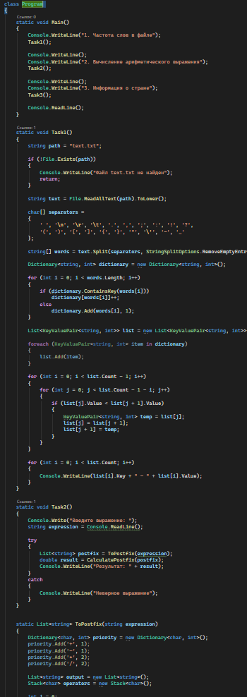
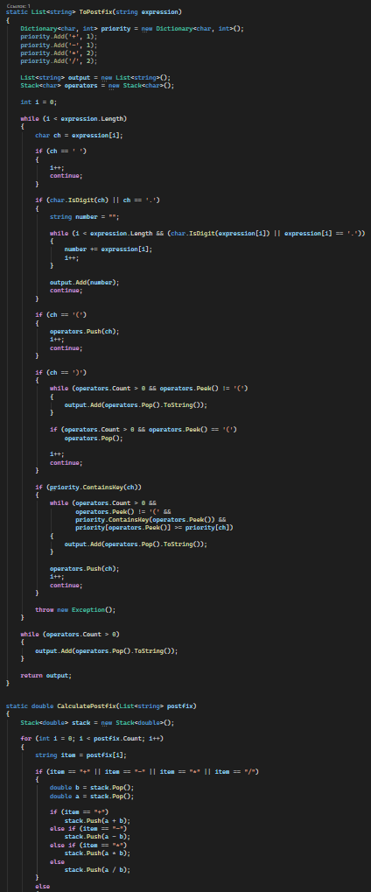
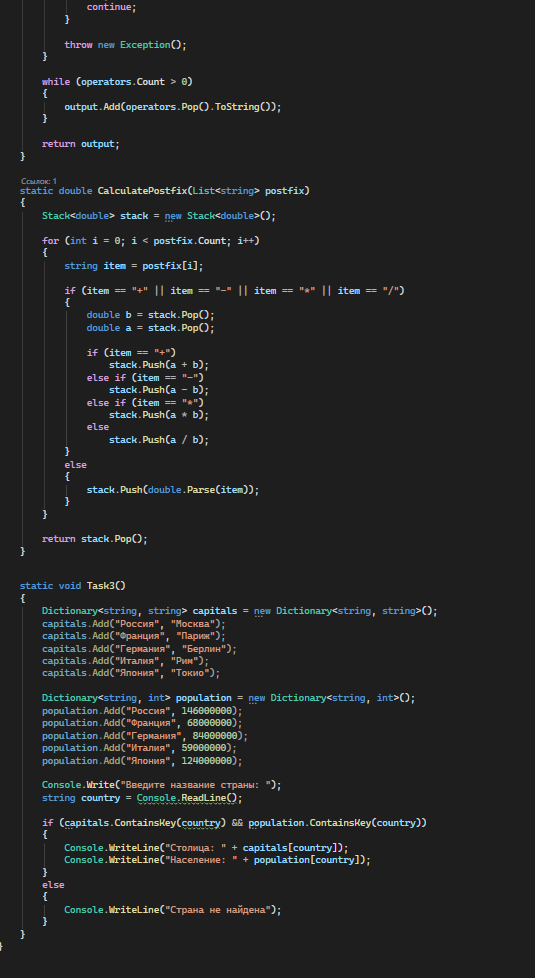
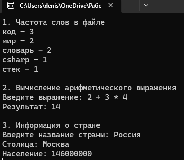

# C# KT14

1. Напишите программу, которая читает текст из файла и выводит на консоль частоту встречаемости каждого слова в тексте. Для этого используйте словарь типа Dictionary<string, int>, где ключом является слово, а значением - количество его повторений в тексте. Затем отсортируйте словарь по убыванию частоты и выведите его содержимое на консоль.

2. Напишите программу, которая принимает на вход строку, содержащую арифметическое выражение, и вычисляет его значение. Для этого используйте словарь типа Dictionary<char, int>, где ключом является оператор (+, -, *, /), а значением - его приоритет. Затем используйте алгоритм обратной польской записи для преобразования выражения в постфиксную форму и вычисления его значения с помощью стека.

3. Напишите программу, которая принимает на вход имя страны и выводит на консоль ее столицу и население. Для этого используйте два словаря типа Dictionary<string, string> и Dictionary<string, int>, где ключами являются названия стран, а значениями - названия столиц и численность населения соответственно. Затем проверьте, есть ли введенная страна в словарях, и если да, то выведите соответствующую информацию.

### Код

### Результат

